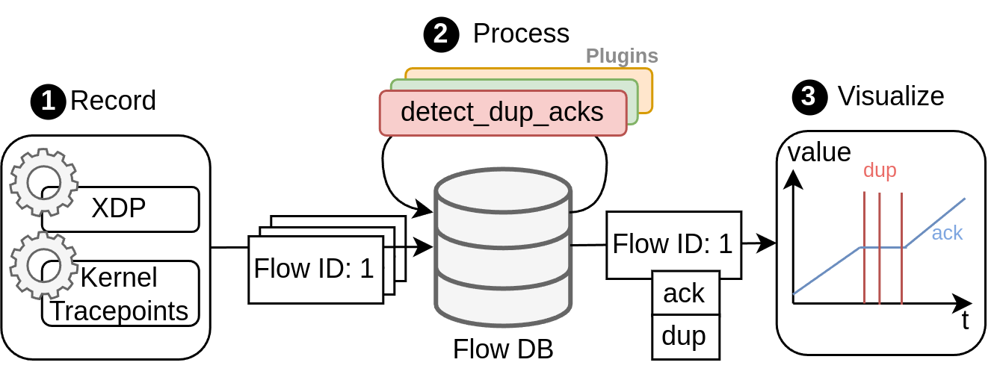
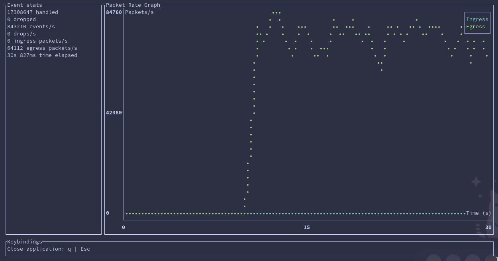
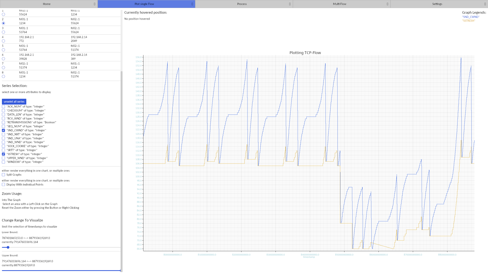
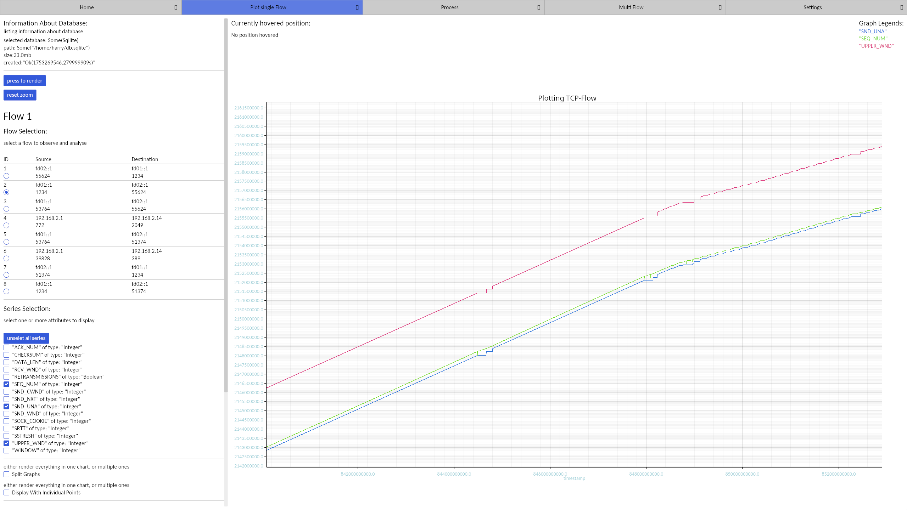
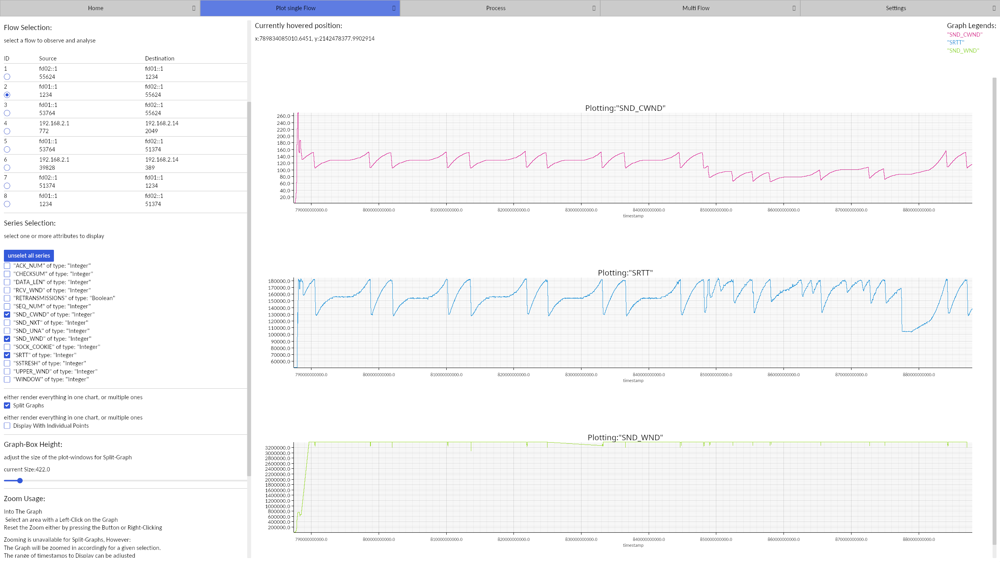
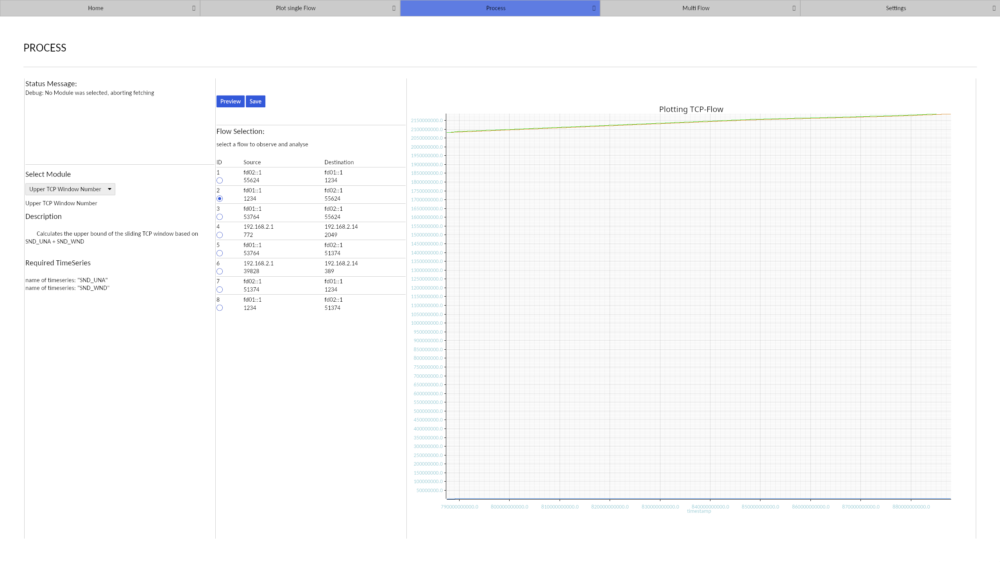
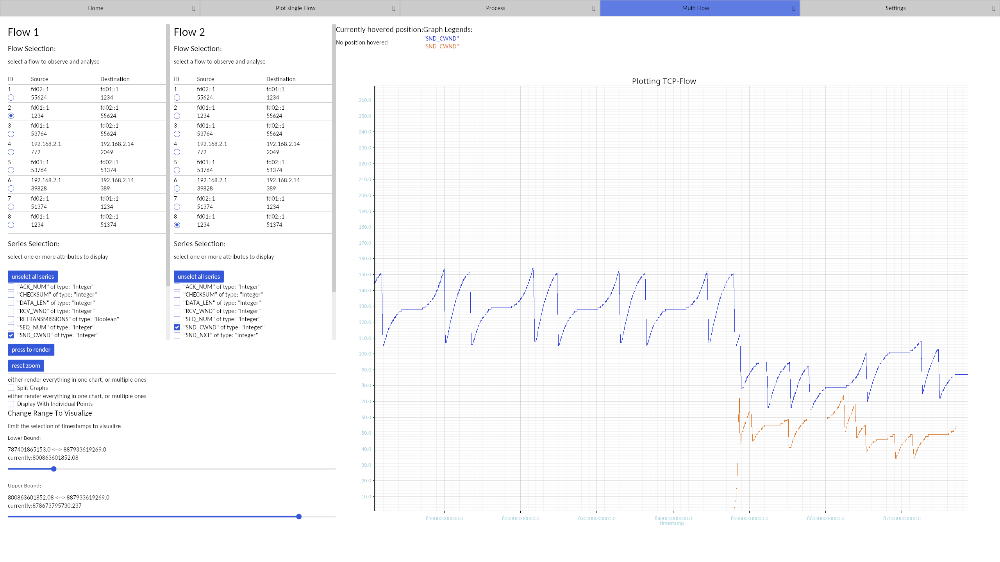

 

 <h6 style="font-size: 10px; margin-left: 200px; margin-top: -30px;">Bee SVG by <a href="https://www.freepik.com/free-vector/cute-bee-insect-animal_136484149.htm#fromView=keyword&page=1&position=2&uuid=42f2e8ed-fa2c-47d9-9793-a1b088c1266d&query=Bees+Svg+File">Freepic</a> </h6>

 <h2>TCBee: A High-Performance and Extensible Tool For TCP Flow Analysis Using eBPF </h2>

    
 

- [Disclaimer](#disclaimer)
- [Overview](#overview)
- [Architecture](#architecture)
  - [1. Record](#1-record)
  - [2. Process](#2-process)
  - [3. Visualize](#3-visualize)
- [Installation](#installation)
  - [Prerequisites](#prerequisites)
  - [Compilation](#compilation)
- [Working with TCBee](#working-with-tcbee)
  - [1. Recording Data](#1-recording-data)
  - [2. Processing Recorded Data](#2-processing-recorded-data)
  - [3. Visualizing Processed Data](#3-visualizing-processed-data)
- [Accessing Recorded Data with Custom Scripts](#accessing-recorded-data-with-custom-scripts)
  - [Using the Rust ts-storage Library](#using-the-rust-ts-storage-library)
  - [Using Custom Scripts and Programs](#using-custom-scripts-and-programs)
  - [Accessing the raw data ouput](#accessing-the-raw-data-ouput)
- [Preview of TCBee](#preview-of-tcbee)
  - [Recording TCP Flows](#recording-tcp-flows)
  - [Visualizing CWND Size](#visualizing-cwnd-size)
  - [Calculating a new metric](#calculating-a-new-metric)
  - [Visualizing Multiple Flows](#visualizing-multiple-flows)

## Disclaimer

This repository contains the first stable version of TCBee and will be improved/refined in the future.
The current Todo-List includes

- Documentation for the tools and interfaces
- Merging tools into a single program
- Add plugins for the calculation of common TCP congestion metrics
- Implement InfluxDB interface for faster processing 
- Test and benchmark bottlenecks (eBPF Ringbuf size, File writer, etc.)
- Cleanup of eBPF and user space code
- ...

The current version is tested for linux kernel 6.13.6 and may not work on older or newer kernel versions.

## Overview

This repository contains the source code for a TCP flow analysis and visualization tool that can monitor any number of TCP flows with up to 1.4 Mpps in total. It uses the Rust programming languages and monitors both packet headers with XDP and TC, and kernel metrics using eBPF.

TCBee

* provides a command-line program to record flows and track current data rates
* monitors both packet headers for incoming and outgoing packets
* hooks onto the linux kernel functions to read tcp kernel metrics **per packet**
* stores recorded data in a structured SQL flow database (SQLite or DuckDB)
* provides a simple plugin interface to calculate metrics from recorded data and save the results
* comes with a visualization tool to analyse and compare TCP flow metrics
* provides a rust library to access flow data for custom visualization tools

Special thanks to Evelyn (https://github.com/ScatteredDrifter) and Lars for their support during development.

## Architecture

The architecture of the TCP analysis tool focuses on achieving a high online processing speed while still being extensible.
To that end, the structure of the tool consists of the three phases: **record**, **process**, and **visualize**.

### 1. Record

The tool monitors incoming and outgoing TCP traffic, identifies flows and stores all available information in a database.
For each flow, the TCP header of every single packet is collected over an eBPF XDP for incoming packets or TC hook for outgoing packets and stored with an associated timestamp.
Further, the eBPF tracepoints monitor kernel metrics such as the congestion window size and store them in the same way.

### 2. Process

Here, more complex metrics are extracted such as duplicate ACK events or retransmissions which would otherwise slow down the live recording.
Further, TCBee provides a plugin system to define the calculation of new metrics.
Writing such a plugin uses a simple interfaces and requires no knowledge about the code of TCBee.

### 3. Visualize

The information from the database can be read by visualization tools that generate graphs or use a GUI to analyze the results.
TCBee uses a strucutred format with SQLite or InfluxDB databases to simplify access for custom scripts and visualization tools.

## Installation

*Note: TCBee was developed on and is designed for linux systems only. It will not work on MacOS or Windows.*
This project was built using the aya rust template: https://github.com/aya-rs/aya-template.
You can visit the project for more information on prerequisites and compiling the project for different architectures.

### Prerequisites

To compile and run the program, the following requirements need to be fulfilled:

- Clang and LLVM (e.g. for Ubuntu `sudo apt install -y llvm clang libelf-dev libclang-dev`)
- Rustup (> 1.28.1), install via [rustup](https://rustup.rs/)
- Stable Rust toolchain `rustup toolchain install stable`
- Nightly Rust toolchain `rustup toolchain install nightly --component rust-src`
- BPF linker `cargo install bpf-linker`

For the visualization tool:

- Pkg-config and fontconfig (e.g. for Ubuntu `sudo apt install -y pkg-config fontconfig libfontconfig1-dev`)

### Compilation

You can build the entire project using `make`, or build single components with `make record`, `make process`, `make viz`.
The resulting binaries will be copied into the `install` folder in the root directory.
Then, move these binaries to any directory that is in your `PATH`.
The `tcbee` script is used as main command and runs the other binaries depending on passed arguments.

Alternatively, you can also build the tool parts manually using cargo.

## Working with TCBee

When working with TCBee, you can call all sub-programs through the `tcbee` script.

### 1. Recording Data

Use `tcbee record [interface]` to start recording data on the specified interface.
You should set at least one (or more) of the following flags to determine which metrics are recorded:

- `-h`, `--headers` to record the TCP headers.
- `-t`, `--tracepoints` to record TCP kernel tracepoints, these contain most but not all recordable TCP kernel metrics.
- `-k`, `--kernel` to record metrics from the kernel functions `tcp_sendmsg` and `tcp_recvmsg`. These contain all available TCP kernel metrics.
- `-w`, `--cwnd` to record the snd_cwnd metric using kernel function tracing. This should provide the highest performance but only records a single metric.

Available optional flags are:

- `-q`, `--quiet` to start the program without the terminal UI
- `-p`, `--port` to filter for flows that have the specified port as source or destination
- `--tui-update-ms` to set an alternative update interval of the UI. May help with tearing, default is 100ms.
- `-c`, `--cpus` to set the number of CPUs used for processing. Defaults to 1, which should be enough in most cases.
- `-d`, `--dir` to set the output directory of recordings. Should be a tempfs, defaults to `/tmp/`

Data recorded by this tool is written as bytes to `*.tcp` files in the provided directory.

### 2. Processing Recorded Data

Use `tcbee process` to read the recorded data and generate the flow database.
You can select either SQLite or DuckDB as the output datbase:

- `-q`, `--sqlite` for SQLite
- `-d`, `--duckdb` for DuckDB, recommended for larger traces and better analysis

Additionally, you can set the source directory and output file using:
- `-s`, `--source` defaults to `/tmp/`
- `-o`, `--output` defaults to `db.sqlite` or `db.duck` in the current directory

### 3. Visualizing Processed Data

Use `tcbee viz` to start the visualization tool.
Once the tool opens, you can load an `*.sqlite` or `*.duck` file to visualize.
You can navigate between plotting, multi-flow plotting, processing and settings via the navigation bar.
The visualization tool is still in development and you may need to resize the window if fields or buttons are missing.

## Accessing Recorded Data with Custom Scripts

If you dont want to use the visualization tool, you can access the recorded data directly from the flow database or directly after the recording.

### Using the Rust ts-storage Library

[ts-storage](ts-storage/) contains a database interface created for TCBee.
It uses an abstract `TSDBInterface` that provides the same interface independant of the used database systems.
For example code and usage, see [ts-storage/README.md](ts-storage/README.md)

### Using Custom Scripts and Programs

You can generate custom graphs and visualization using your own tools and scripts by accessing the flow database directly.
To that end, you either need to implement access over SQLite or DuckDB depending on the storage format.
You could also use SQL queries to access/manipulate the data in the DB directly.
For a guide on how to read flow data, see [ts-storage/ACCESS.md](ts-storage/ACCESS.md).

### Accessing the raw data ouput

TCBee stores the recorded data in raw byte files under `/tmp/*.tcp`. 
If you want to read the raw bytes from your own program, take a look at [tcbee-record/tcbee-common/src/bindings/](tcbee-record/tcbee-common/src/bindings/) to find the appropriate structs (struct names that are written end with `_entry`).

## Preview of TCBee

### Recording TCP Flows

### Visualizing CWND Size

### Calculating a new metric

### Visualizing Multiple Flows

