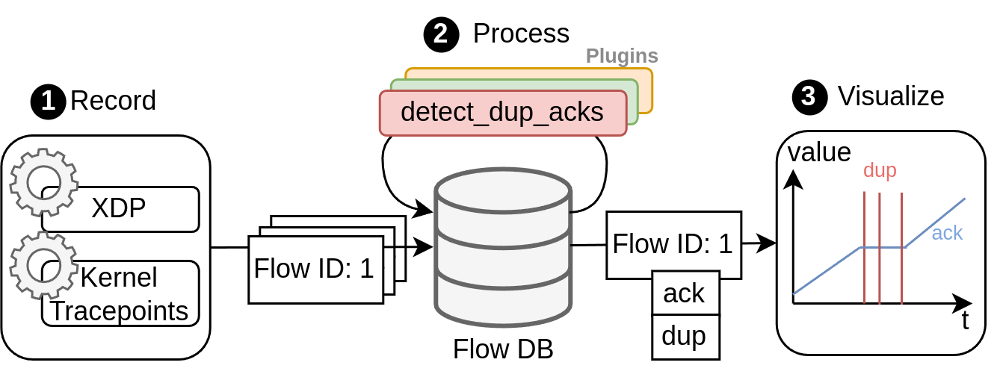
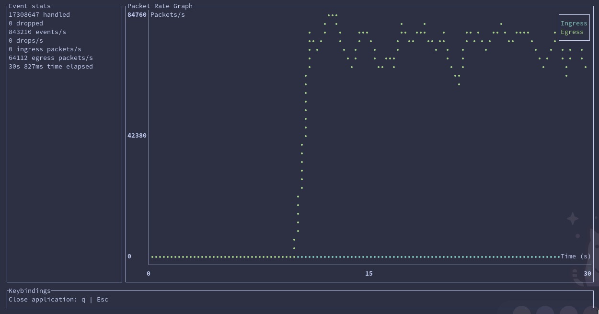
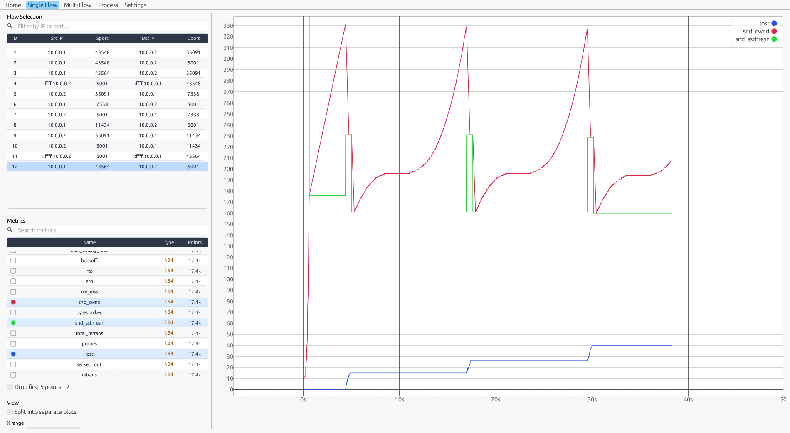
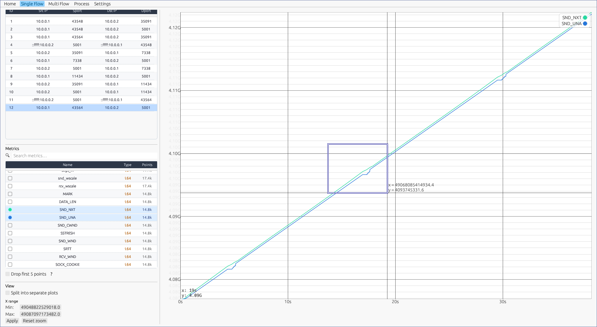
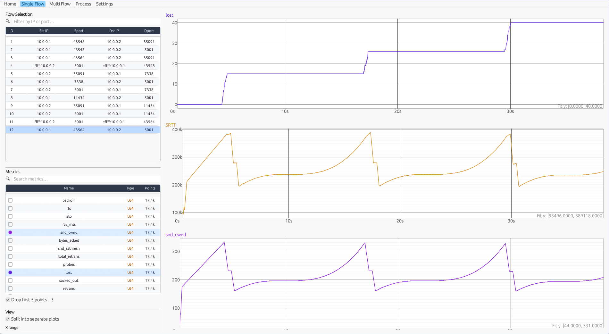
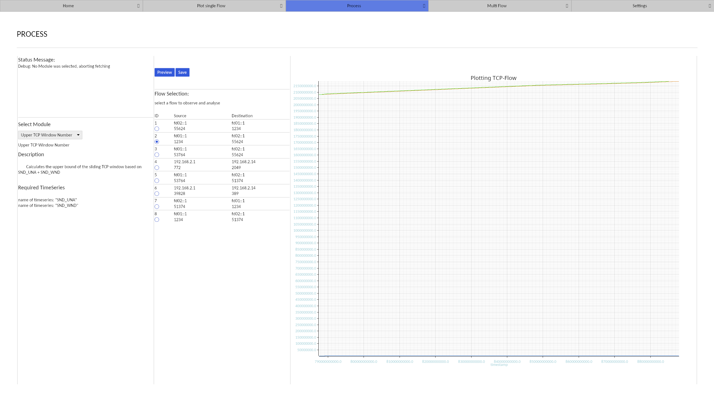
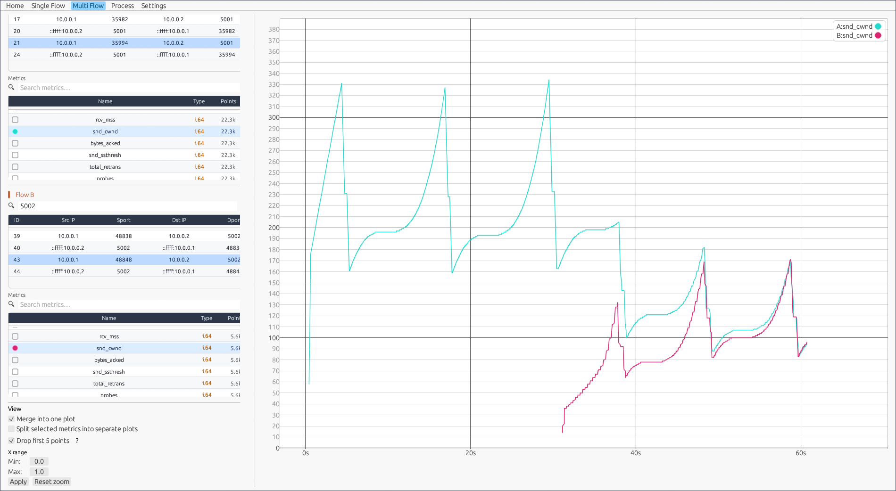

<div align="center">
 
 <h2>TCBee: A High-Performance and Extensible Tool For TCP Flow Analysis Using eBPF </h2>

    [](https://github.com/uni-tue-kn/TCBee/actions/workflows/tcbee.yml)
 
</div>

- [Disclaimer](#disclaimer)
- [Overview](#overview)
- [Architecture](#architecture)
  - [1. Record](#1-record)
  - [2. Process](#2-process)
  - [3. Visualize](#3-visualize)
- [tcbee-live](#tcbee-live)
- [Installation](#installation)
  - [Prerequisites](#prerequisites)
  - [Compilation](#compilation)
- [Working with TCBee](#working-with-tcbee)
  - [1. Recording Data](#1-recording-data)
  - [2. Processing Recorded Data](#2-processing-recorded-data)
  - [3. Visualizing Processed Data](#3-visualizing-processed-data)
- [Accessing Recorded Data with Custom Scripts](#accessing-recorded-data-with-custom-scripts)
  - [Using the Rust ts-storage Library](#using-the-rust-ts-storage-library)
  - [Using Custom Scripts and Programs](#using-custom-scripts-and-programs)
  - [Accessing the raw data output](#accessing-the-raw-data-output)
- [Testing](#testing)
- [Preview of TCBee](#preview-of-tcbee)
  - [Recording TCP Flows](#recording-tcp-flows)
  - [Visualizing CWND Size](#visualizing-cwnd-size)
  - [Calculating a new metric](#calculating-a-new-metric)
  - [Visualizing Multiple Flows](#visualizing-multiple-flows)
- [AI Assistance Disclosure](#ai-assistance-disclosure)

## Disclaimer

This repository contains the first stable version of TCBee and will be improved/refined in the future.
The current Todo-List includes

- Documentation for the tools and interfaces
- Merging tools into a single program
- Add plugins for the calculation of common TCP congestion metrics
- Implement InfluxDB interface for faster processing 
- Test and benchmark bottlenecks (eBPF Ringbuf size, File writer, etc.)
- Cleanup of eBPF and user space code
- ...

The current version is tested for linux kernel 6.13.6 and may not work on older or newer kernel versions.

## Overview

A TCP flow analysis and visualization tool built in Rust that can monitor any number of TCP flows with up to 1.4 Mpps total throughput. It captures packet headers via XDP and TC, and tracks kernel metrics using eBPF function hooks with a variety of attachment points.

TCBee

* provides a command-line program to record flows and track current data rates
* monitors both packet headers for incoming and outgoing packets
* hooks onto the linux kernel functions to read tcp kernel metrics **per packet or function call**
* stores recorded data in a structured SQL flow database (SQLite or DuckDB)
* provides a simple plugin interface to calculate metrics from recorded data and save the results
* comes with a visualization tool to analyse and compare TCP flow metrics
* provides a rust library to access flow data for custom visualization tools

Special thanks to Evelyn (https://github.com/ScatteredDrifter) and Lars for their support during development.

## Architecture

The tool is designed for high-speed online processing with extensibility in mind. It's structured around three phases: **record**, **process**, and **visualize**.



### 1. Record

TCBee monitors incoming and outgoing TCP traffic, identifies flows, and stores all available information in a database.
For each flow, TCP headers from every packet are collected via eBPF XDP (incoming) or TC hooks (outgoing) and stored with timestamps.
eBPF tracepoints also monitor kernel metrics like congestion window size.
See [tcbee-record/README.md](tcbee-record/README.md) for details.

### 2. Process

This phase extracts more complex metrics like duplicate ACK events or retransmissions that would bog down live recording.
TCBee provides a plugin system for calculating custom metrics.
Writing plugins is straightforward and doesn't require understanding TCBee's internals.
See [tcbee-process/README.md](tcbee-process/README.md) for details.

### 3. Visualize

Flow data from the database can be analyzed through visualization tools that generate graphs or provide a GUI.
TCBee uses a structured format with SQLite or DuckDB databases to simplify access for custom scripts and visualization tools.

## tcbee-live

`tcbee-live` is a live cwnd monitor that requires no post-processing step. It attaches eBPF probes and displays congestion window metrics in real time via an egui GUI. Useful for quick inspection of a running flow without writing data to disk.

```bash
cd tcbee-live
cargo build --release
sudo ./target/release/tcbee-live --select-port 5001
```

See [tcbee-live/README.md](tcbee-live/README.md) for full documentation.

## Installation

*Note: TCBee is Linux-only. It won't work on MacOS or Windows.*

Built using the [aya rust template](https://github.com/aya-rs/aya-template). Check their docs for more info on prerequisites and cross-compilation.

### Prerequisites

To compile and run the program, the following requirements need to be fulfilled:

- Clang and LLVM (e.g. for Ubuntu `sudo apt install -y llvm clang libelf-dev libclang-dev`)
- Rustup (> 1.28.1), install via [rustup](https://rustup.rs/)
- Stable Rust toolchain `rustup toolchain install stable`
- Nightly Rust toolchain `rustup toolchain install nightly --component rust-src`
- BPF linker `cargo install bpf-linker`

For the database libraries (SQLite and DuckDB):

- SQLite development headers (e.g. for Ubuntu `sudo apt install -y libsqlite3-dev`, for Arch `sudo pacman -S sqlite`)
- DuckDB shared library and headers — download the appropriate release from the [DuckDB GitHub releases](https://github.com/duckdb/duckdb/releases) and install them to a location your linker can find (e.g. `/usr/local/lib` and `/usr/local/include`)

> **Shipping to systems without DuckDB or SQLite installed?** Enable the `bundled` feature for either library in [ts-storage/Cargo.toml](ts-storage/Cargo.toml) to compile the library from source and statically link it — no system installation required on the target machine. Note that this significantly increases compile times.
> ```toml
> duckdb = { version = "1.3.2", features = ["bundled"] }
> sqlite = { version = "0.36.1", features = ["bundled"] }
> ```

For the visualization tool:

- Pkg-config and fontconfig (e.g. for Ubuntu `sudo apt install -y pkg-config fontconfig libfontconfig1-dev`)

### Compilation

Build the entire project with `make`, or individual components with `make record`, `make process`, `make viz`.
Binaries are copied to the `install` folder.
Move these binaries to a directory in your `PATH`.
The `tcbee` script acts as the main command and calls the appropriate binary based on arguments.

Alternatively, build components manually with cargo.

## Working with TCBee

All sub-programs are called through the `tcbee` script.

### 1. Recording Data

Start recording with `tcbee record`.
Set at least one of the following flags to determine which metrics to record:

- `-h [interface]`, `--headers [interface]` to record the TCP headers.
- `-t`, `--tracepoints` to record TCP kernel tracepoints, these contain most but not all recordable TCP kernel metrics.
- `-k`, `--kernel` to record metrics from the kernel functions `tcp_sendmsg` and `tcp_recvmsg`. These contain all available TCP kernel metrics.
- `-w`, `--cwnd` to record the snd_cwnd metric using kernel function tracing. This should provide the highest performance but only records a single metric.
- `-a`, `--algorithms` to record the internal behaviour of congestion control algorithms (Cubic and BBR)

Available optional flags are:

- `-q`, `--quiet` to start the program without the terminal UI
- `-p`, `--port` to filter for flows that have the specified port as source or destination
- `-m`, `--metrics` to output a file containing general metrics (events handled, events lost, etc.). Stored as `metrics.json` in the output directory.
- `--tui-update-ms` to set an alternative update interval of the UI. May help with tearing, default is 100ms.
- `-c`, `--cpus` to set the number of CPUs used for processing. Defaults to 1, which should be enough in most cases.
- `-d`, `--dir` to set the output directory of recordings. Should be a tempfs, defaults to `/tmp/`

Recorded data is written as raw bytes to `*.tcp` files in the specified directory.

### 2. Processing Recorded Data

Run `tcbee process` to read the recorded data and generate the flow database.
Choose either SQLite or DuckDB as the output database:

- `-q`, `--sqlite` for SQLite
- `-d`, `--duckdb` for DuckDB, recommended for larger traces and better analysis

Additionally, you can set the source directory and output file using:
- `-s`, `--source` defaults to `/tmp/`
- `-o`, `--output` defaults to `/tmp/db.sqlite` or `/tmp/db.duck`


### 3. Visualizing Processed Data

Start the visualization tool with `tcbee viz`.
Load an `*.sqlite` or `*.duck` file to visualize your data.
Navigate between plotting, multi-flow plotting, processing and settings using the navigation bar.
Note: The viz tool is still in development. You may need to resize the window if UI elements are cut off.

## Accessing Recorded Data with Custom Scripts

If you don't want to use the visualization tool, you can access the recorded data directly from the flow database or straight from the raw recording files.

### Using the Rust ts-storage Library

[ts-storage](ts-storage/) is TCBee's database interface library.
It provides an abstract `TSDBInterface` that works the same regardless of whether you're using SQLite or DuckDB.
See [ts-storage/README.md](ts-storage/README.md) for examples and usage.

### Using Custom Scripts and Programs

Generate custom graphs and visualizations by accessing the flow database directly with your own scripts.
Use SQLite or DuckDB libraries depending on your storage format, or just run SQL queries directly.
Check the [`examples/db/`](examples/db/) folder or [ts-storage/README.md](ts-storage/README.md) for guides on reading flow data.

### Accessing the raw data output

TCBee stores raw recording data as byte files in `/tmp/*.tcp`.
To read these files from your own program, check [tcbee-record/tcbee-common/src/bindings/](tcbee-record/tcbee-common/src/bindings/) for the appropriate structs (look for struct names ending with `_entry`).
See the [`examples/raw/`](examples/raw/) folder for Python scripts demonstrating this.

## Testing

The [`testing/`](testing/) folder contains a Mininet-based emulation environment for both `tcbee-live` and `tcbee-record`. It sets up a bottleneck topology, drives traffic with `iperf3`, and launches the selected tool automatically. See [testing/README.md](testing/README.md) for setup and usage.

## Preview of TCBee

### Recording TCP Flows




### Visualizing CWND Size







### Calculating a new metric



### Visualizing Multiple Flows



## AI Assistance Disclosure

This project has been developed with assistance from AI-powered coding tools for code generation and documentation. All code has been reviewed, tested, and verified by human developers before inclusion.
