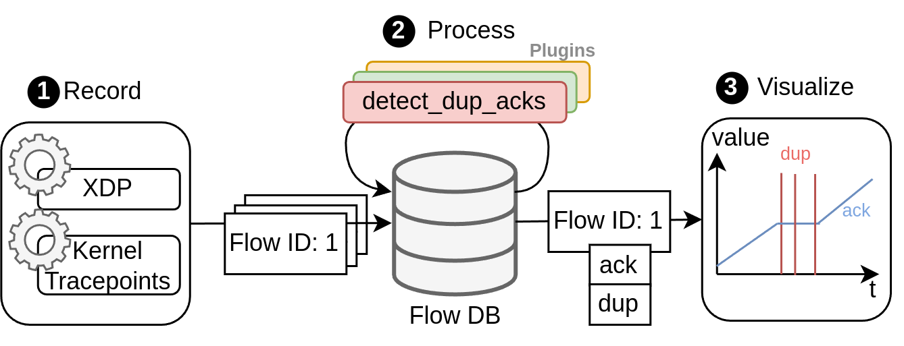
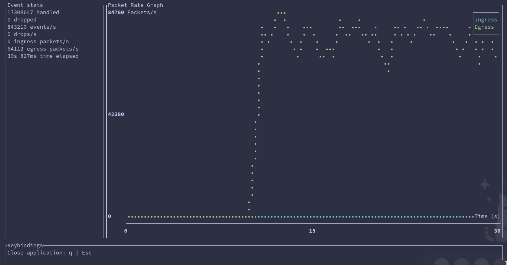
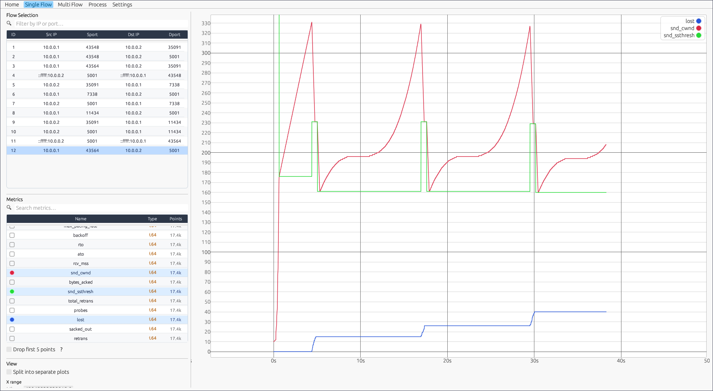
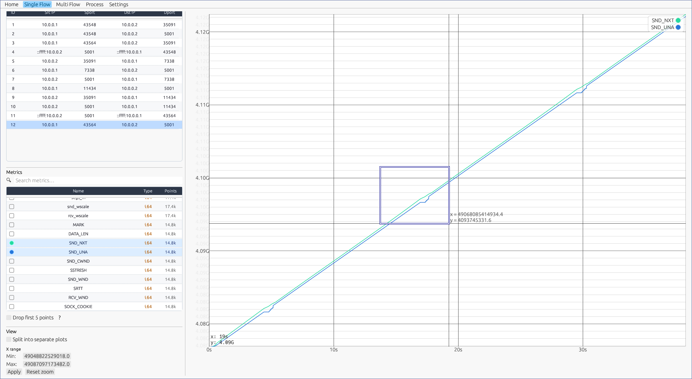
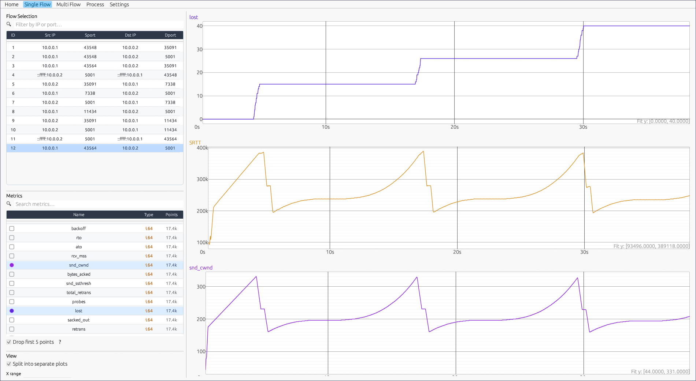
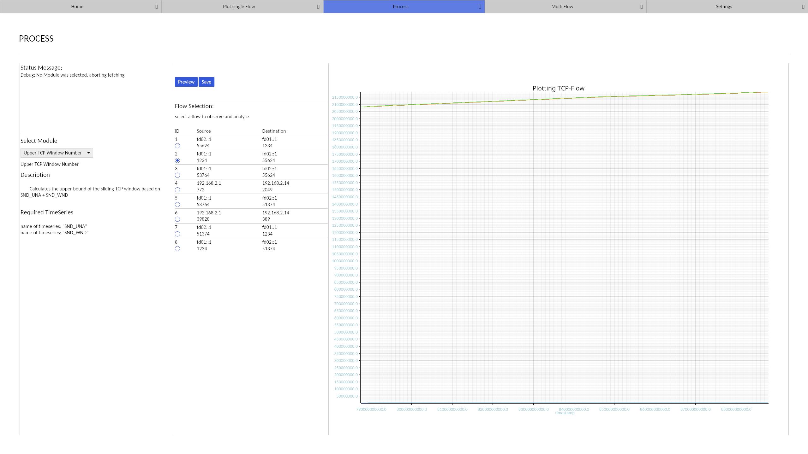
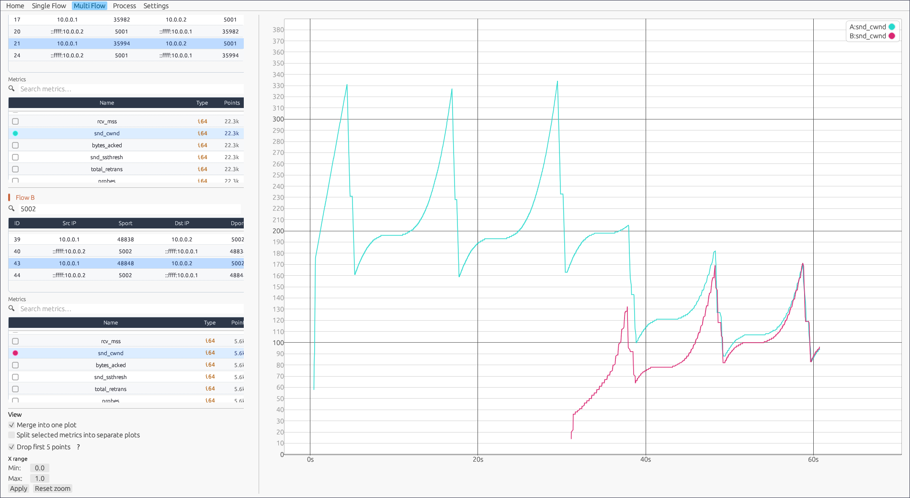

<div align="center">
 
 <h2>TCBee: TCP Flow Analysis with eBPF</h2>

    [](https://github.com/uni-tue-kn/TCBee/actions/workflows/tcbee.yml)

 *Special thanks to [Evelyn](https://github.com/ScatteredDrifter) and Lars for their support during development.*

</div>

TCBee monitors TCP flows at up to 5M events/s. It captures packet headers via TC hooks, reads kernel metrics through eBPF function hooks, and stores everything in a DuckDB or SQLite database for offline analysis and visualization.

**Linux-only.** Tested on kernel 6.13.6.

---

- [Quick Start](#quick-start)
  - [Prerequisites](#prerequisites)
  - [Build](#build)
  - [Building without waiting for DuckDB](#building-without-waiting-for-duckdb)
  - [Record → Process → Visualize](#record--process--visualize)
- [What TCBee Does](#what-tcbee-does)
- [Architecture](#architecture)
- [Usage](#usage)
  - [`tcbee record`](#tcbee-record)
  - [`tcbee process`](#tcbee-process)
  - [`tcbee viz`](#tcbee-viz)
- [tcbee-live](#tcbee-live)
- [Custom Data Access](#custom-data-access)
- [Testing](#testing)
- [Screenshots](#screenshots)
  - [Recording](#recording)
  - [Visualization](#visualization)
- [Status](#status)

---

## Quick Start

### Prerequisites

**Build tools:**
- Rust stable: [rustup.rs](https://rustup.rs/)
- Clang/LLVM, libelf and zlib headers: `sudo apt install -y llvm clang libclang-dev libelf-dev zlib1g-dev pkg-config make`
- tcbee-live only: nightly toolchain and BPF linker: `rustup toolchain install nightly --component rust-src && cargo install bpf-linker`

tcbee-record compiles its eBPF programs with clang and loads them with libbpf; see [tcbee-record/README.md](tcbee-record/README.md) for the static release build and kernel requirements (BTF, 5.8+, 5.9+ for `-k`/`-w`/`-a`).

**Database libraries** (only for non-bundled builds, see [Build](#build)):
- SQLite: `sudo apt install -y libsqlite3-dev` (Arch: `sudo pacman -S sqlite`)
- DuckDB: download the shared library and headers from [duckdb/duckdb releases](https://github.com/duckdb/duckdb/releases) and install them to `/usr/local/`. The version should match the `duckdb` crate in `Cargo.lock` (`1.10506.x` is DuckDB 1.5.6). Or let cargo fetch the matching release itself: `DUCKDB_DOWNLOAD_LIB=1`.

**Visualization:**
- `sudo apt install -y pkg-config fontconfig libfontconfig1-dev`

**Testing environment:**
- Python 3
- Mininet
- Open vSwitch
- iperf3
- Linux with root privileges for Mininet and eBPF programs

### Build

```bash
make           # builds everything; binaries are copied to install/
# or individually:
make record
make process
make viz
make live
```

Move the binaries from `install/` to a directory in your `PATH`. The `tcbee` script dispatches to the right binary based on the subcommand.

`tcbee-process`, `tcbee-viz` and the `ts-storage` library are one cargo workspace in the repository root with a single `target/` and `Cargo.lock`; `tcbee-record` and `tcbee-live` have their own. Without the Makefile:

```bash
cargo build --release -p tcbee-process -p tcbee-viz   # binaries in target/release/
cd tcbee-record && cargo build --release              # binary in tcbee-record/target/release/
```

**Storage engines.** `tcbee-process` and `tcbee-viz` have the cargo features `sqlite` and `duckdb` (both on by default) and `bundled`:

```bash
cargo build --release -p tcbee-process -p tcbee-viz                                         # both engines, system libraries
cargo build --release -p tcbee-process -p tcbee-viz --no-default-features --features sqlite # SQLite only, DuckDB is never compiled
cargo build --release -p tcbee-process -p tcbee-viz --no-default-features --features duckdb # DuckDB only
cargo build --release -p tcbee-process -p tcbee-viz --features bundled                      # both engines compiled in (release zip)
```

`make process viz CARGO_FLAGS="--features bundled"` does the same through the Makefile. A binary built without an engine reports that when it is given a file of that engine. `bundled` compiles SQLite and DuckDB from source (about ten minutes for DuckDB).

### Building without waiting for DuckDB

DuckDB's build script runs again (and with `bundled` recompiles all of DuckDB) when its build inputs change. In this workspace `cargo build -p`, `cargo test` and `cargo clippy` of `ts-storage`, `tcbee-process` and `tcbee-viz` share one compiled `libduckdb-sys`, as long as you keep to the same:

- `bundled` or not: they are two separate builds.
- Profile: `--release` and the default debug build are separate.
- `RUSTFLAGS` and the other cargo environment (including the `DUCKDB_*` variables below).

Build from the repository root; a `target/` per crate would compile DuckDB once per crate. `workspace-hack/` and the `[profile.dev.build-override]` in the root `Cargo.toml` exist so that the choice of `-p` does not change the build; if `cargo tree -p tcbee-viz -e features -i syn@3` shows `syn` features that are missing in [workspace-hack/Cargo.toml](workspace-hack/Cargo.toml), add them there.

For development you do not need `bundled`. Without it `libduckdb-sys` only links a `libduckdb` that is already there, which takes seconds. These environment variables of its build script choose the library:

| Variable | Effect |
|---|---|
| `DUCKDB_LIB_DIR=/opt/duckdb` | directory with `libduckdb.so` (and `duckdb.h`) |
| `DUCKDB_INCLUDE_DIR=...` | directory with `duckdb.h`, if it is elsewhere |
| `DUCKDB_STATIC=1` | link `libduckdb_static.a` |
| `DUCKDB_DOWNLOAD_LIB=1` | download the official `libduckdb` for the crate's DuckDB version into `target/` and link it |

Set them for every cargo command, or put them into an uncommitted `.cargo/config.toml` in the repository root:

```toml
[env]
DUCKDB_LIB_DIR = "/opt/duckdb"
```

A binary that is linked to a dynamic `libduckdb` outside the standard library path must find the `.so` when it starts. `cargo run` and `cargo test` take care of that; a binary started directly from `target/` does not, so install the library to a standard path or set `LD_LIBRARY_PATH`.

### Record → Process → Visualize

```bash
# 1. Record a TCP flow (Ctrl+C to stop)
sudo tcbee record -h eth0 -k

# 2. Process the raw recording into a database (the extension selects DuckDB or SQLite)
tcbee process -o /tmp/myflow.duck

# 3. Open the visualization tool
tcbee viz
```

---

## What TCBee Does

- Captures incoming and outgoing TCP headers via TC eBPF hooks
- Reads kernel TCP metrics (cwnd, ssthresh, srtt, ...) per packet or function call
- Stores recordings in a SQLite or DuckDB database (one table per event type, nanosecond timestamps)
- Provides a plugin interface to compute derived metrics (e.g. retransmissions, duplicate ACKs) during post-processing
- Includes an interactive visualization tool for plotting and comparing flows
- Exposes a Rust library (`ts-storage`) for building custom analysis tools

---

## Architecture

TCBee works in three phases: **record**, **process**, and **visualize**.



**Record:** attaches eBPF probes and writes raw event data to `*.tcp` files. TC hooks capture packet headers; function hooks and tracepoints read kernel TCP metrics.

**Process:** reads the raw files with multiple threads and writes a structured SQL database.

**Visualize:** loads the database and displays interactive graphs. Plugins run here to compute derived metrics and save them back into the database. You can also query the database directly with your own scripts or tools.

Per-module documentation: [tcbee-record](tcbee-record/README.md) · [tcbee-process](tcbee-process/README.md) · [ts-storage](ts-storage/README.md)

---

## Usage

All subcommands are called through the `tcbee` script.

### `tcbee record`

At least one metric source flag is required.

Metric sources:

| Flag | Description |
|---|---|
| `-h [iface]` | TCP headers via TC on the given interface |
| `-t` | Kernel tracepoints (most TCP metrics) |
| `-k` | `__tcp_transmit_skb`/`tcp_rcv_established` hooks (all TCP metrics) |
| `-w` | `snd_cwnd` only (best performance, single metric) |
| `-a` | Congestion control internals (Cubic and BBR) |

Filtering:

| Flag | Default | Description |
|---|---|---|
| `-p PORT` | | Fast single-port filter for source or destination port |
| `--ports PORTS` | | Comma-separated source or destination ports |
| `--src-ports PORTS` | | Comma-separated source ports |
| `--dst-ports PORTS` | | Comma-separated destination ports |
| `--ips IPS` | | Comma-separated source or destination IPv4/IPv6 addresses |
| `--src-ips IPS` | | Comma-separated source IPv4/IPv6 addresses |
| `--dst-ips IPS` | | Comma-separated destination IPv4/IPv6 addresses |

Filtering is disabled by default, so probes only take the fast no-filter branch. Use
`-p`/`--port` when a single local or remote port is enough; this uses the fastest filtered path.
The multi-value port and IP filters use eBPF maps for exact matches. Values inside one option are
ORed, while port and IP dimensions are ANDed. For example, `--ports 80,443 --ips 10.0.0.1`
records traffic where either endpoint port is 80 or 443 and either endpoint IP is `10.0.0.1`.

Other options:

| Flag | Default | Description |
|---|---|---|
| `-d DIR` | `/tmp/` | Output directory for raw recordings |
| `-c N` | `1` | Number of CPUs used for processing |
| `-q` | | Disable the terminal UI |
| `-m` | | Write a `metrics.json` summary file |
| `--tui-update-ms N` | `100` | TUI refresh interval in milliseconds |

Raw data is written as `*.tcp` files to the output directory.

### `tcbee process`

Reads a raw recording and writes a flow database:

```bash
tcbee process -o /tmp/myflow.duck       # DuckDB (recommended for large traces)
tcbee process -o /tmp/myflow.sqlite     # SQLite
tcbee process -d                        # DuckDB, /tmp/db.duck
tcbee process -s ~/traces/tcbee_2026-10-05T18-16-22 -o flows.db -f -t 4
```

| Flag | Default | Description |
|---|---|---|
| `-s DIR` | `/tmp/` | Recording directory (holds the `*.tcp` files), or a directory to search for the latest `tcbee_*` recording |
| `-o FILE` | `/tmp/db.sqlite` with `-q`, `/tmp/db.duck` with `-d` | Output database file |
| `-q`, `--sqlite` | | Write SQLite |
| `-d`, `--duckdb` | | Write DuckDB |
| `-t N`, `--threads N` | number of cores | Worker threads |
| `-f`, `--force` | | Replace the output file if it exists |

**Engine.** `-q` or `-d` decide. Without them the extension of `-o` does: `.sqlite` and `.db` are SQLite, `.duck` and `.duckdb` DuckDB. If neither gives an engine the command fails. An engine that is not compiled in is an error too (see [Build](#build)).

**Output.** An existing output file is never touched without `-f`. The database is written to `<output>.partial` and renamed when everything succeeded, so a failed run leaves no half-written file. Files without a decoder (`tcp_retransmit_synack`, `tcp_bad_csum`) are skipped with a message. A truncated last record (the recorder was stopped mid-write) is dropped with a warning. Any other problem in a trace file (wrong divider, undecodable record, read error) stops the run. A summary line reports records, rows, flows, series, time and output size.

**Exit codes.** `0` success (and `--help`), `1` processing failed (unreadable or corrupt recording, existing output without `-f`, I/O or database error), `2` wrong arguments.

**Format.** Databases use schema version 2: one table per record type (`ev_sock`, `ev_tcp_probe`, `ev_cwnd`, `ev_cubic`, `ev_bbr`, `ev_tcp4`, `ev_tcp6`) with one row per record and one typed column per field, plus the `flows` and `series` catalogs. Timestamps are exact integer nanoseconds. Send and receive samples of a flow are separate series. Databases written by earlier versions are not readable; process the recording again. Details are in [ts-storage/README.md](ts-storage/README.md).

### `tcbee viz`

```bash
tcbee viz
```

```bash
tcbee viz /tmp/myflow.duck   # open a database right away
```

Load a `.sqlite`, `.db`, `.duck` or `.duckdb` file from within the tool, or give it as the argument. The engine is detected from the file contents, not from the extension, and the home tab shows it. A file of an engine that was not compiled into this build, a file that is not a database, and a pre-schema-2 file each show an error message in the tool. The navigation bar switches between single-flow plots, multi-flow comparison, the processing panel, and settings.

---

## tcbee-live

A live cwnd monitor with no recording or post-processing needed. Attaches eBPF probes and shows congestion window metrics in real time via a GUI.

```bash
make live
sudo ./install/tcbee live --select-port 5001
```

See [tcbee-live/README.md](tcbee-live/README.md) for details. tcbee-live is built on the [aya rust template](https://github.com/aya-rs/aya-template).

---

## Custom Data Access

The flow database is standard SQLite or DuckDB and can be queried with any compatible client or library.

- **Rust:** use the `ts-storage` library, see [ts-storage/README.md](ts-storage/README.md)
- **Other languages:** use any SQLite/DuckDB client. The tables and columns are described in [ts-storage/README.md](ts-storage/README.md#database-layout-schema-version-2); [`examples/db/`](examples/db/) has Python scripts that list flows and plot the congestion window
- **Raw `*.tcp` files:** packed structs; struct definitions are in [tcbee-record/tcbee-common/src/bindings/](tcbee-record/tcbee-common/src/bindings/) (look for names ending in `_entry`); Python reader examples are in [`examples/raw/`](examples/raw/)

---

## Testing

The [`testing/`](testing/) directory has a Mininet-based emulation environment. It sets up a bottleneck topology, drives traffic with `iperf3`, and launches `tcbee-record`, `tcbee-live`, or the full record/process/visualize pipeline automatically.

Additional packages for the test environment:

```bash
# Debian / Ubuntu
sudo apt install -y mininet openvswitch-switch iperf3 python3

# Arch Linux
sudo pacman -S mininet openvswitch iperf3 python
sudo systemctl start ovsdb-server ovs-vswitchd
```

Before running the tests, build the tools you want to exercise:

```bash
make           # build record, process, viz, and live
# or individually:
make record
make process
make viz
make live
```

(`make process viz` builds into the `target/` of the repository root; the launcher looks there.)

Run the launcher from the repository root:

```bash
python3 testing/run.py
```

The launcher needs root-capable networking through Mininet, and `tcbee-record` / `tcbee-live` need eBPF privileges. See [testing/README.md](testing/README.md) for the topology and menu options.

---

## Screenshots

### Recording




### Visualization







---

## Status

This is the first stable release. Work in progress:

- Documentation for all modules
- Merging tools into a single binary
- Plugins for common TCP congestion metrics
- InfluxDB interface for faster processing
- Ringbuffer and file writer benchmarks
- Code cleanup

---

*Developed with AI coding assistance. All code reviewed and verified by human developers before inclusion.*
