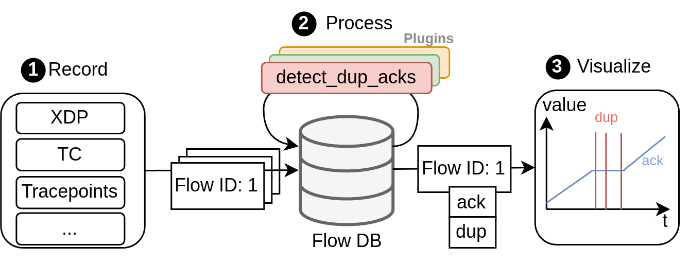
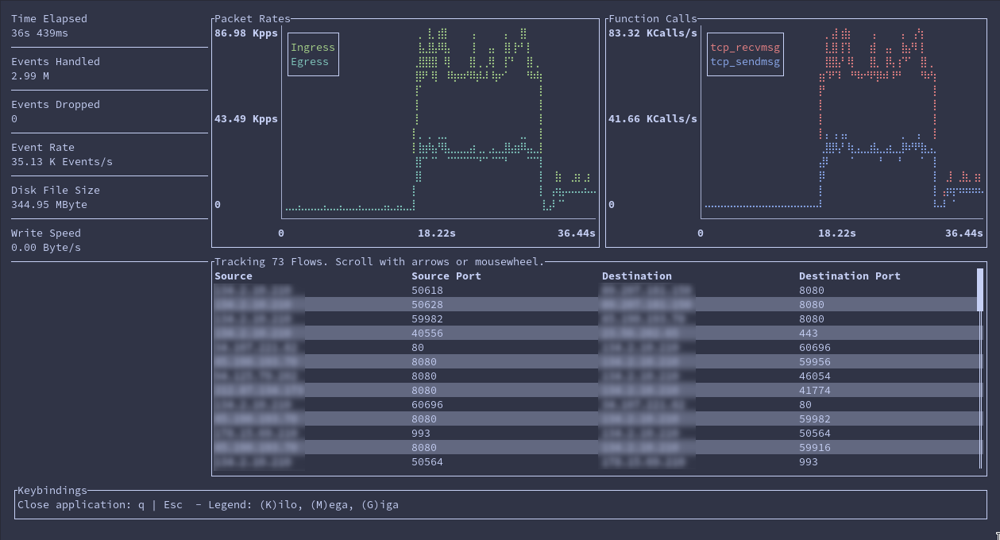

 

 <h6 style="font-size: 10px; margin-left: 200px; margin-top: -30px;">Bee SVG by <a href="https://www.freepik.com/free-vector/cute-bee-insect-animal_136484149.htm#fromView=keyword&page=1&position=2&uuid=42f2e8ed-fa2c-47d9-9793-a1b088c1266d&query=Bees+Svg+File">Freepic</a> </h6>

 <h2>TCBee: A High-Performance and Extensible Tool For TCP Flow Analysis Using eBPF </h2>

    
 

- [Disclaimer](#disclaimer)
- [Overview](#overview)
- [Architecture](#architecture)
  - [1. Record](#1-record)
  - [2. Process](#2-process)
  - [3. Visualize](#3-visualize)
- [Prerequisites](#prerequisites)
- [Working with TCBee](#working-with-tcbee)
  - [1. Recording Traffic](#1-recording-traffic)
  - [2. Postprocessing Recorded Data](#2-postprocessing-recorded-data)
  - [2. Visualizing Data](#2-visualizing-data)
    - [2a. Using TCBee-Viz](#2a-using-tcbee-viz)
    - [2b. Using the rust ts-storage library](#2b-using-the-rust-ts-storage-library)
    - [2c. Using custom scripts and programs](#2c-using-custom-scripts-and-programs)
    - [2d. Accessing the raw data ouput](#2d-accessing-the-raw-data-ouput)
- [Preview of TCBee](#preview-of-tcbee)
  - [Recording TCP Flows](#recording-tcp-flows)
  - [Visualizing CWND Size](#visualizing-cwnd-size)
  - [Visualizing Multiple Flows](#visualizing-multiple-flows)

## Disclaimer
This repository contains the first stable version of TCBee and will be improved/refined in the future.
The current Todo-List includes
- Documentation for the tools and interfaces
- Merging tools into a single program
- Add plugins for the calculation of common TCP congestion metrics
- Implement InfluxDB interface for faster processing 
- Test and benchmark bottlenecks (eBPF Ringbuf size, File writer, etc.)
- Cleanup of eBPF and user space code
- ...

The current version is tested for linux kernel 6.13.6 and may not work on older or newer kernel versions.

## Overview
This repository contains the source code for a TCP flow analysis and visualization tool that can monitor any number of TCP flows with up to 1.4 Mpps in total. It uses the Rust programming languages and monitors both packet headers with XDP and TC, and kernel metrics using eBPF.

TCBee

* provides a command-line program to record flows and track current data rates
* monitors both packet headers for incoming and outgoing packets
* hooks onto the linux kernel functions `tcp_sendmsg` and `tcp_recvmsg` to read kernel metrics
* stores recorded data in a structured flow database
* provides a simple plugin interface to calculate metrics from recorded data and save the results
* comes with a visualization tool to analyse and compare TCP flow metrics
* provides a rust library to access flow data for custom visualization tools

## Architecture
The architecture of the TCP analysis tool focuses on achieving a high online processing speed while still being extensible.
To that end, the structure of the tool consists of the three phases: **record**, **process**, and **visualize**.

### 1. Record
The tool monitors incoming and outgoing TCP traffic, identifies flows and stores all available information in a database.
For each flow, the TCP header of every single packet is collected over an eBPF XDP for incoming packets or TC hook for outgoing packets and stored with an associated timestamp.
Further, the eBPF tracepoints monitor kernel metrics such as the congestion window size and store them in the same way.

### 2. Process
Here, more complex metrics are extracted such as duplicate ACK events or retransmissions which would otherwise slow down the live recording.
Further, TCBee provides a plugin system to define the calculation of new metrics.
Writing such a plugin uses a simple interfaces and requires no knowledge about the code of TCBee.

### 3. Visualize
The information from the database can be read by visualization tools that generate graphs or use a GUI to analyze the results.
TCBee uses a strucutred format with SQLite or InfluxDB databases to simplify access for custom scripts and visualization tools.

## Prerequisites
TODO: Add linux kernel version!
*Note: TCBee was developed on and is designed for linux systems only. It will not work on MacOS or Windows.*
This project was built using the aya rust template: https://github.com/aya-rs/aya-template. You can visiit the project for more information on prerequisites and compiling the project for different architectures.

To compile and run the program, the following requirements need to be fulfilled:
- Clang and LLVM (e.g. for Ubuntu `sudo apt install -y llvm clang libelf-dev libclang-dev`)
- Rust (> Version TODO), e.g. install via [rustup](https://rustup.rs/)
- Stable Rust toolchain `rustup toolchain install stable`
- Nightly Rust toolchain `rustup toolchain install nightly --component rust-src`
- BPF linker `cargo install bpf-linker`

For the visualization tool:
- Pkg-config and fontconfig (e.g. for Ubuntu `sudo apt install -y pkg-config fontconfig libfontconfig1-dev`)

After that you can start each individual component using `cargo run --release`.

## Working with TCBee
*Note: TCBee is currently split into three programs due to development reasons. It may be aggregated into a single program later on.*
### 1. Recording Traffic
`tcbee` contains the code for capturing TCP packets and kernel metrics.
It uses a terminal UI to display information about event and packet rates.
To run the recording with cargo: 

`cargo run --release --config 'target."cfg(all())".runner="sudo -E"'  -- [interface]`

Or, you can run the compiled version after using `cargo build --release` using:

`sudo target/release/tcbee [interface]`

Available flags are:
- `-q`, `--quiet` run the program without the UI
- `-p`, `--port` filter streams for remote or local port
- `f`, `--file` path to store the output (CURRENTLY NOT IMPLEMENTED)

TCBee will store the recorded data under `/tmp/` as `.tcp` files. These files contain the packet headers and kernel metrics data as raw bytes.
If you want to read the raw bytes from your own program, take a look at `tcbee/tcbee-common/bindings` to find the appropriate structs (struct names that are written end with `_entry`).

### 2. Postprocessing Recorded Data
`db` contains the code to read the `/tmp/*.tcp` files into a structured database format.
To run the postprocessing with cargo use:

`cargo run --release --config 'target."cfg(all())".runner="sudo -E"'`

Or, you can run the compiled version after using `cargo build --release` using:

`sudo target/release/db_backend`

Currently, this will generate a db.sqlite file in the same directory.
If this file exists, the program will try to write to the same DB and exit as soon as it detects duplicate data.
In future releases, the DB backend will support both Sqlite and InfluxDB and custom file paths.
This should also improve performance issues for large traces with a lot of data points.

### 2. Visualizing Data

The reocrded data can be visualized in three possible ways.

#### 2a. Using TCBee-Viz
`viz-tool` contains the code to read the `db.sqlite` file and visualize the stored flow data.
It plots the recorded metrics of multiple flows over a shared timebase, has a zoom function and can store images.
You can start the visualization tool with cargo:

`cargo run --release`

Or, you can run the compiled version after using `cargo build --release` using:

`target/release/viz-tool`

Then, you can select a database file to load and use the navbar to access the different functions.

#### 2b. Using the rust ts-storage library
`ts-storage` contains a database interface created for TCBee.
It uses an abstract `TSDBInterface` that provides the same interface independant of the used database systems.
For example code, see `ts-storage/README.md`.

#### 2c. Using custom scripts and programs
You can generate custom graphs and visualization using your own tools and scripts by accessing the flow database directly.
To that end, you either need to implement access over SQLite or InfluxDB depending on the storage format.
For a guide on how to read flow data, see `ts-storage/ACCESS.md`.

#### 2d. Accessing the raw data ouput
TCBee stores the recorded data in raw byte files under `/tmp/*.tcp`. 
If you want to read the raw bytes from your own program, take a look at `tcbee/tcbee-common/bindings` to find the appropriate structs (struct names that are written end with `_entry`).

## Preview of TCBee

### Recording TCP Flows

### Visualizing CWND Size

### Visualizing Multiple Flows

