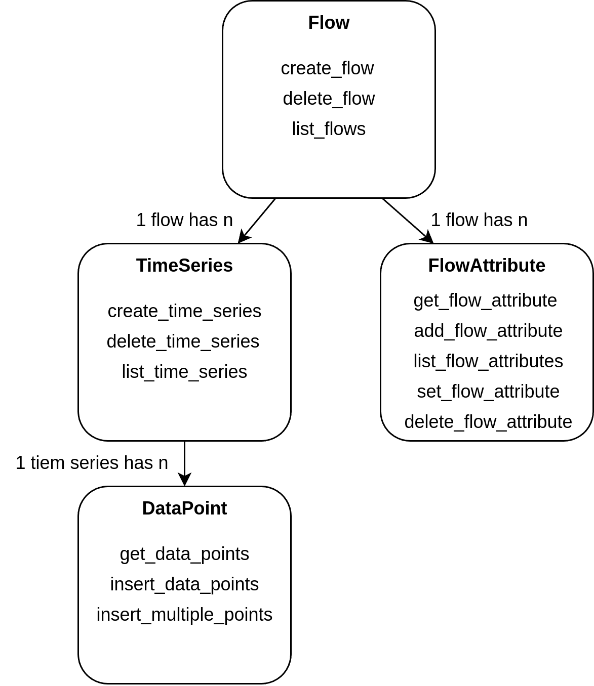
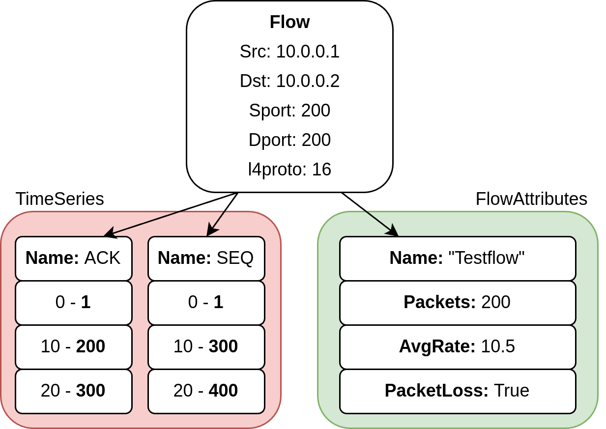

# Documentation

## Data Model

### Flow
Identified by IP-5 tuple, created using create_flow function.

### TimeSeries
Each flow can have n associated time series. 
A time series is a collection of DataPoints with the same value type (INT, Float, ...) and context.
For example, the ACK and SEQ numbers of a stream are two time series.

### DataPoints
Values associated with a time series.
They consist of a timestamp and a value.
E.g. a DataPoint could be the ACK number of a packet at the received timestamp t.

## Example
